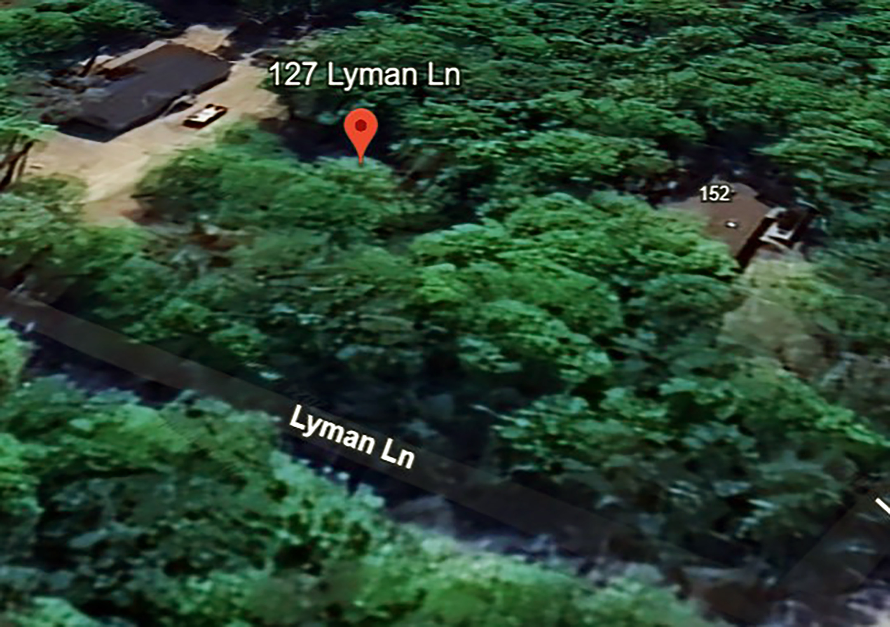
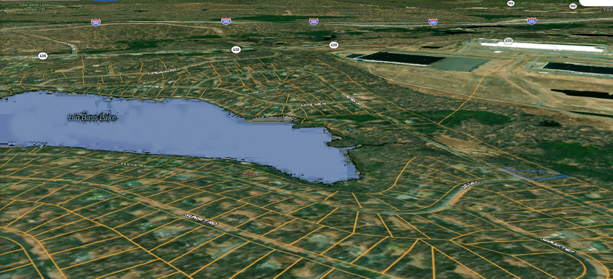

# TODO

# Site notes

For the level 3 make sure that there is also a spot for videos if needed.

Move the "Family-size Affordable Lots Are Our Specialty" part of the home page down and make the text smaller, more like the WordPress website.

For level 4, make the image as big as possible and have the below.

For level 3, have the option for videos as well.

So for level three with the image thumbnails, have the width 100% and the height be the same.

Have the tree as the background.

# Things for 12/27
Have the website completely add images details for each county.

Make the file update system so that she can edit them herself.

Add a tutorial about how to use the system.

Copy the styling for the WordPress version.

# Things that need to be made

I need to make a file browser that can browse the markdown files of the website and add markdown files and upload images. See if there is a library that can give you a file browser GUI and a text editor, just basic, and some way to add images to the website. I don't know how I should host the markdown files. I could use GitHub that updates a repo and pushes it to that, or maybe something else. I have to research that for Netlify.

# Hot Reloading on Netlify build
https://www.gatsbyjs.com/docs/reference/local-development/fast-refresh/
[Fast Refresh](https://www.npmjs.com/package/react-refresh) is an implementation of Hot Reloading with full support from React. It replaces unofficial solutions like [`react-hot-loader`](https://github.com/gaearon/react-hot-loader)

https://www.gatsbyjs.com/docs/refreshing-content/

During local development, it can be useful to refresh sourced content without restarting the development server. To facilitate this, Gatsby exposes an environment variable called `ENABLE_GATSBY_REFRESH_ENDPOINT`.

If set to `true`, this will expose a `/__refresh` webhook that can receive POST requests to refresh the sourced content. This exposed webhook can be triggered whenever remote data changes.

You can trigger this endpoint locally, for example, on Unix-based operating systems (like Ubuntu and macOS) using `curl -X POST http://localhost:8000/__refresh`.

Additionally, the sourced content can also be refreshed with the “Refresh Data” button in the [GraphiQL explorer](https://www.gatsbyjs.com/docs/how-to/querying-data/running-queries-with-graphiql). This button is only visible if `ENABLE_GATSBY_REFRESH_ENDPOINT` is set to `true`.

Securing the refresh endpoint is possible by supplying a value for the environmental variable `GATSBY_REFRESH_TOKEN`, which will cause Gatsby to only accept requests with a matching authorization header. For example `GATSBY_REFRESH_TOKEN=12345` would require a request with header: `authorization: 12345`.

## This is probably the way
https://stackoverflow.com/questions/60628026/how-do-i-force-a-data-refresh-in-gatsbyjs-when-im-using-a-source-plugin-that-ca

This works but probably doesn't scale.

1. Start Gatsby with `ENABLE_GATSBY_REFRESH_ENDPOINT=true gatsby develop` or put the setting in the .env file
2. Use `curl -X POST http://localhost:8000/__refresh` to invoke a full refresh.
3. Alternatively, make it repeatedly call the hook to trigger a refresh periodically with `watch -n5 "curl -X POST http://localhost:8000/__refresh"` (every 5 seconds in this case, tune as needed) or put it in a crontab for unattended refresh with longer intervals.

Changes to source data will now be reflected, at the expense of hammering the source. I only needed this for development, and might not be a great idea for production use.

Only thing is that I need to make like an admin page or something to give permissions to do this authorization code.

Probably just a simple login admin page that gives you an authorization code that changes dynamically or something.

So that is how you are going to get reloading for it.

Now we need a file editor and markdown editor that would be in the browser and some way to push changes to the GitHub repo to make it permanent.

https://github.com/Saifullah-dev/react-file-manager

How do you make it so when you open a file it goes to the Monaco editor then you can save it and it works upload for that for the server.

https://github.com/microsoft/monaco-editor?utm_source=chatgpt.com

# Saving file using Monaco editor

Yes, you can save files edited with Monaco Editor in your React application. Monaco Editor provides an API to retrieve the current content of the editor, which you can then save to a file on the server or trigger a download in the browser. Here's how you can implement this functionality:

```
fetch('/save-file', {
  method: 'POST',
  headers: {
    'Content-Type': 'application/json',
  },
```

Add the feature to use the page background with the markdown file.

# The File Structure for the website

## Pennsylvania

### Luzerne

- Hazelton
    
- Mink Springs
    
### Pike

- Bartlett
    
- Cowan Rd
    
### Wayne County

- Dyberry
### Lackawanna

- 1114 Drinker Tnpk Moscow
    
- Hilldell Rd Moscow
    
- Langan Rd Moscow
    
- Lyman Lane Gouldsboro

# Level 3 Logic
So if there are just photos of the property, you just have the property tag.

If there are property and neighbor photos, you have the property and neighbor, and they both take up the right-hand side around 30% of the page.

The other 70% of the page is the main image.

Each photo for the property has a space thumbnail that is like 50 x 50 px in size but in relative sizing like rem.

There should also be an option if there are video property and neighbor sections, which would then give each of those a divide of that 30% on the right. So like top is neighbor, middle is property, bottom is video, but that is only if those are in there. So if it is just neighbor, have that take the full space up. If it is both neighbor and property, then split. If all 3, then thirds.

Syntax 

**Markdown extended**

[Section[MainImage]]
```

```
[[ImageDesc]This is an aerial screenshot of the property]

[End[Mainimage]]

So for the main image, this is the image that takes up 70% of the screen, then the description is under it.

If not in the main image section and it is a level 3 page:

```
[Section[Property]]

# Property


[[ImageDesc]This is a photo of the Big Bass Lake and the property]
[end[Property]]
```

Those image descriptions will go to the level 4 script and will not be displayed on the page, so that is just the variable for the level 4 script if it is not in the main image section.

# Level 4 Javascript

So for the level 4 JavaScript, I want it to take the image and then when you click on it, it gives the full-size image with the description that comes with it, having the image take up as much space as possible.


# Get the level 3 page to have the mainimage have it's description visable under it on the main page


# make darby for wayne and fix 717 n wills ave

# add logic if there is only one property for the property page
to style it so that its not like 1000 px wide

st louis county for example
try and use css only logic for that.

When you add an image to a file like  it for some reason needs spaces so you can have the name like welcometopennsylvania.jpg and it will not work. I should fix that.